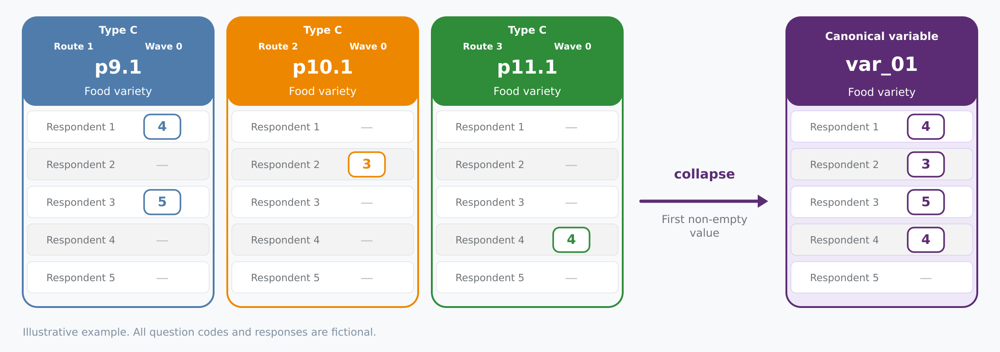
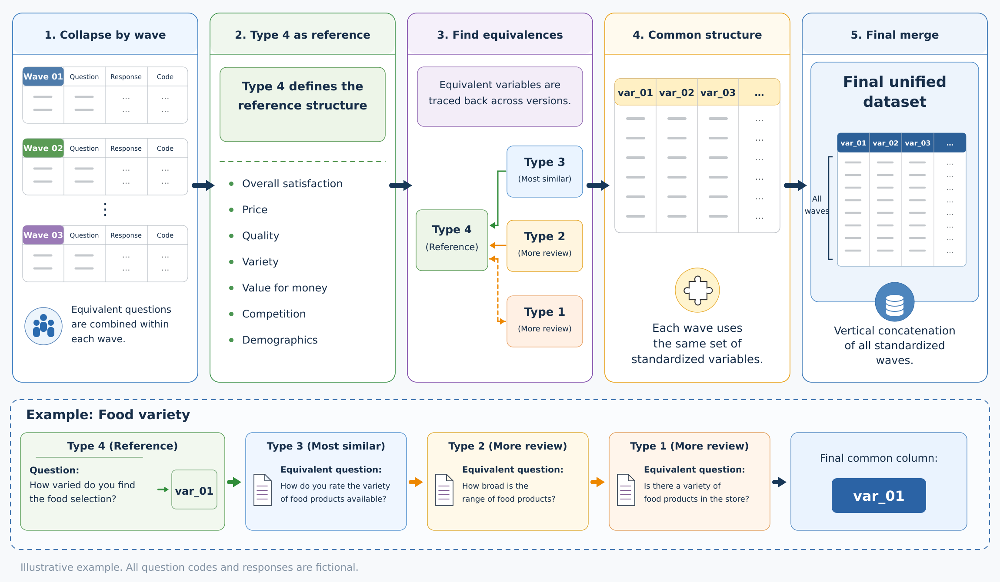
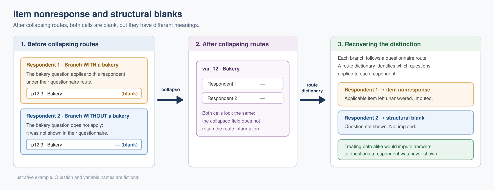
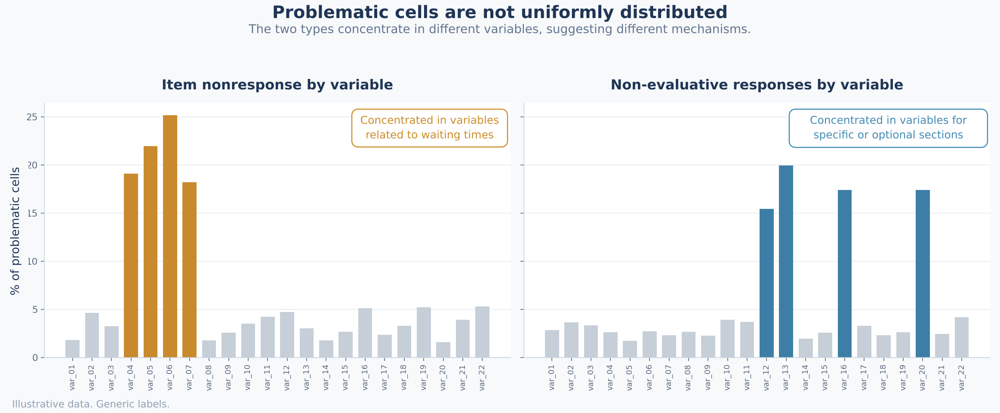
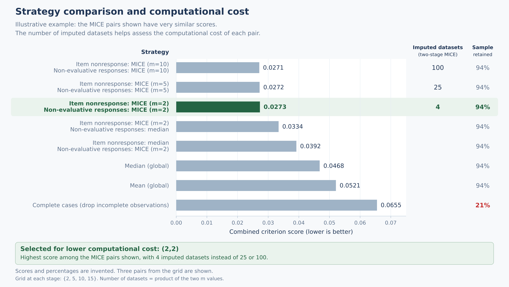

# Analyzing satisfaction surveys: methodological decisions

[Español](README.md) | **English**

This repository provides a brief overview of the main methodological decisions in my undergraduate thesis in Data Science (Licenciatura en Ciencias de Datos) at the University of Buenos Aires, Faculty of Exact and Natural Sciences. The work involved integrating surveys from a supermarket chain and analyzing which aspects of the shopping experience were associated with overall satisfaction.

Due to confidentiality restrictions, I cannot publish the company name, original data, or numerical results. All examples and diagrams use invented information for illustrative purposes. The codes and values in these examples serve only to explain the procedures.

## Contents

1. [Building a harmonized dataset](#1-building-a-harmonized-dataset)
2. [Item nonresponse, structural blanks, and non-evaluative responses](#2-item-nonresponse-structural-blanks-and-non-evaluative-responses)
3. [Distribution of problematic cells and missingness mechanism](#3-distribution-of-problematic-cells-and-missingness-mechanism)
4. [Selecting an imputation strategy](#4-selecting-an-imputation-strategy)
5. [Modeling decisions](#5-modeling-decisions)
6. [References](#6-references)

## 1. Building a harmonized dataset

The surveys were stored in files corresponding to different survey waves, meaning separate periods of response collection. The questionnaire had also changed between these periods.

To build a harmonized dataset, I first combined equivalent questions within each wave. I then mapped the correspondences between questionnaire versions.

### Combining questions within each wave

The questions each person received depended on the store's characteristics and services. These paths through the questionnaire, referred to as *routes*, meant that the same aspect could appear in different columns.

For example, a question about food variety could be recorded as `p9.1`, `p10.1`, or `p11.1`, depending on the route. To analyze that aspect across routes, I combined the responses from the equivalent columns into a single canonical variable.

Because the routes were mutually exclusive, at most one of these questions could apply to each survey. The columns were collapsed row by row: the first non-empty value among the equivalent columns was taken, preserving the original response. This included non-evaluative responses, whose treatment was addressed later. If all equivalent columns were empty, the resulting variable also remained empty.

*Figure 1. Illustrative example of constructing a canonical variable from questions located in different routes. The codes, questions, and responses are invented.*

### Mapping questionnaire versions

Collapsing the columns resolved the differences between routes, but datasets from different waves could still have different structures. The wording, position, and organization of questions had changed between versions.

I used the most recent version as the reference because it incorporated the revisions made to the questionnaire. Its structure was more compact than that of the earliest versions. Starting from its questions relevant to the analysis, I identified equivalent aspects in the earlier questionnaires.

Establishing these correspondences required reviewing the content of the questions. In the illustrative example, “How varied do you find the food selection?” and “How do you rate the variety of food products available?” are assigned to the same variable because both assess the variety of the selection.

When an aspect had no equivalent question in a version, its column remained empty in the corresponding waves. All waves therefore shared the same structure, although some variables were only available for part of the period.

Using this mapping, I assigned common names to equivalent variables and concatenated the standardized waves, retaining one row per survey.

*Figure 2. Illustrative overview of the integration process: collapsing columns within each wave, identifying equivalences between versions, and concatenating the standardized datasets.*

Integration required preserving information about the origin of empty cells. In particular, collapsing the columns removed the distinction between an unanswered question and a question that did not apply to the person's route.

## 2. Item nonresponse, structural blanks, and non-evaluative responses

Among the questions available in each questionnaire version, I distinguished two types of empty cells:

- **Item nonresponse:** the question belonged to the person's route but was left unanswered.
- **Structural blank:** the question was not part of that route.

This distinction mattered because only the first case represented nonresponse to an applicable question. Counting both in the same way would mix nonresponse with the questionnaire's structure.

### Recovering route information

After the columns were collapsed, both cases could appear as an empty cell in the canonical variable. To recover their origin, I used a dictionary identifying the route assigned to each store within each questionnaire version.

By cross-referencing this information with the harmonized dataset, I could distinguish item nonresponse from structural blanks and retain that classification for subsequent stages. I also had to account for question availability across versions: a question absent from a questionnaire did not represent an omission by the respondent.

*Figure 3. Illustrative example of two empty cells with different origins. Route information distinguishes an unanswered question from a question that did not apply. The questions and responses are invented.*

### Responses outside the ordinal scale

The evaluative questions used an ordinal satisfaction scale. Some recorded responses did not express an evaluation on that scale and therefore could not be ordered alongside the evaluative categories.

Treating these responses as additional satisfaction levels would have imposed an order that their meaning did not justify. I therefore identified them separately from ordinal responses and blanks to assess how to handle them when comparing imputation strategies.

Structural blanks were treated separately, reflecting the fact that the question did not apply. Their encoding for the model is described in the modeling decisions section.

## 3. Distribution of problematic cells and missingness mechanism

Before choosing an imputation strategy, I analyzed item nonresponse and non-evaluative responses separately. The aim was to assess how many observations would be lost by using complete cases only and to examine how these cells were distributed.

### Characterizing the patterns

The analysis covered three levels:

- **By survey and questionnaire version:** the number of unanswered applicable items and non-evaluative responses in each observation, grouped by questionnaire type.
- **By variable:** the frequency of each type of problematic cell in the evaluative questions.
- **By store:** the distribution of item nonresponse and non-evaluative responses across the different settings in which the questionnaire was administered.

The percentages by variable used different denominators. For item nonresponse, I considered surveys in which the question applied. For non-evaluative responses, I considered respondents who had answered that question. In the comparison by store, both percentages were calculated over applicable cells.

*Figure 4. Illustrative example of the distribution of item nonresponse and non-evaluative responses. The variables and percentages are invented.*

This characterization helped assess both the amount of information that would be lost by removing observations and the possibility that item nonresponse and non-evaluative responses arose from different mechanisms.

### Working assumption for imputation

The patterns examined motivated proceeding without assuming MCAR: I did not assume that the absence of an evaluation was independent of both observed and unobserved information. This decision was based on the descriptive analysis of the distributions.

To apply MICE, I adopted MAR as a working assumption: the probability of missingness could depend on observed information, but was assumed to be independent of unobserved values conditional on that information ([van Buuren, 2018](#ref-van-buuren-2018)).

The available data could not verify this assumption or rule out an MNAR mechanism, in which missingness would still depend on unobserved information after accounting for the available information. I therefore also compared MICE with other strategies for handling problematic cells. This comparison assessed how sensitive the correlation structure was to the different imputation decisions, while keeping the uncertainty about the missingness mechanism explicit.

## 4. Selecting an imputation strategy

The choice of how to handle problematic cells had to account for two aspects: how much it changed the associations between variables and how many observations it retained. To compare these aspects, I defined a criterion based on Spearman correlation matrices and the resulting sample size.

### Alternatives evaluated

I compared strategies based on MICE ([Raghunathan et al., 2001](#ref-raghunathan-2001)), imputation using the mean or median of the variable or block, and combinations that treated item nonresponse and non-evaluative responses differently. I also included complete-case analysis and alternatives that filtered observations according to their number of problematic cells.

This comparison assessed different ways of completing or filtering the dataset while keeping the two types of problematic cells separate.

### Comparison criterion

I used the *pairwise* Spearman correlation matrix as the reference, calculated using the observations with valid responses for both variables in each pair. To construct it, blanks and non-evaluative responses were represented as missing values.

I chose Spearman because the evaluative variables came from ordinal scales. The comparison therefore focused on associations between their ranks.

Let $R^P$ be the reference matrix and $R^E$ the matrix obtained under a treatment alternative $E$. For each pair of variables, I defined the absolute difference:

$$\Delta_{jk}^{P,E} = \left|R_{jk}^{P}-R_{jk}^{E}\right|.$$

I considered the set of pairs

$$S=\lbrace (j,k):1\leq j\lt k\leq p\rbrace ,$$

where $p$ is the number of variables. The condition $j\lt k$ excludes the diagonal and avoids counting the same pair twice.

I then calculated the mean of these differences:

$$\overline{\Delta}^{P,E} = \frac{1}{|S|} \sum_{(j,k)\in S}\Delta_{jk}^{P,E}.$$

I also calculated the 90th percentile of the absolute differences. The mean summarizes the overall change between the matrices, while the 90th percentile incorporates differences in the upper part of the distribution.

The combined criterion was defined as:

$$C^{P,E} = \frac{ \lambda\thinspace \overline{\Delta}^{P,E} + (1-\lambda)\thinspace  Q_{0.90}\negthinspace \left( \lbrace \Delta_{jk}^{P,E}:(j,k)\in S\rbrace  \right) }{ N_E }, \qquad 0\leq\lambda\leq1,$$

where $N_E$ is the number of observations retained by alternative $E$, and $Q_{0.90}$ is the 90th percentile. I used $\lambda=0.5$, giving equal weight to both components.

For the same difference between matrices, dividing by $N_E$ favors the alternative that retains more observations. The criterion therefore combines proximity to the reference with sample retention.

*Figure 5. Illustrative comparison of strategies using the criterion defined above. Three pairs from the MICE grid are shown to illustrate the choice based on computational cost when score differences are small. The scores and retained-sample percentages are invented.*

The pairwise matrix serves as an empirical reference for the comparison. Proximity to it does not guarantee recovery of the associations that would be present in a fully observed dataset.

### Configuration search and parsimony

Each strategy had its own configuration choices. Some depended on the number of imputations; others, on the allowed number of problematic cells per observation.

For the alternative using MICE for both types of cells, the procedure had two stages: unanswered applicable items were imputed first, followed by non-evaluative responses. I defined $m_{\mathrm{blanks}}$ as the number of datasets generated in the first stage, and $m_{\mathrm{NE}}$ as the number generated in the second stage for each dataset from the first. I explored:

$$m_{\mathrm{blanks}},\thinspace m_{\mathrm{NE}}\in\lbrace 2,5,10,15\rbrace .$$

In this procedure, the total number of datasets generated was:

$$m_{\mathrm{total}} = m_{\mathrm{blanks}}\thinspace m_{\mathrm{NE}}.$$

The alternatives were compared using the criterion defined above, while also considering their computational cost. Within MICE, the configuration $(m_{\mathrm{blanks}},m_{\mathrm{NE}})=(2,2)$ had the highest score among the pairs evaluated. Since the differences between pairs were small under this criterion, I chose that configuration for its lower computational cost: it generated four imputed datasets in the two-stage procedure.

I also considered the stochastic nature of the procedure, which meant that small differences between configurations could depend on the seeds used.

## 5. Modeling decisions

I fitted linear models to study which aspects of the shopping experience were associated with overall satisfaction.

### Representing structural blanks

To construct the model matrix, I centered the evaluative variables using their defined values among applicable observations. I then assigned zero to structural blanks. With this representation, a variable that did not apply to a survey made no contribution to its linear predictor.

### Weighting and uncertainty

The distribution of overall satisfaction was imbalanced. To reduce the dominance of the most frequent responses in the fit, I used weighted least squares (WLS), with weights inversely proportional to the frequency of the response groups. I combined some infrequent categories solely to calculate the weights and moderate extreme weights.

Diagnostics on the OLS model residuals provided evidence of heteroskedasticity. I therefore used HC3 robust standard errors to estimate the uncertainty of the coefficients ([MacKinnon and White, 1985](#ref-mackinnon-white-1985)).

### Variable selection and temporal validation

I aimed to reduce the number of variables while retaining the ability to interpret each aspect evaluated. I used sequential feature selection (SFS), which added variables according to their contribution to reducing weighted mean squared error in temporal validation.

Variables continued to be added while the improvement exceeded a tolerance `tol`. I tuned this tolerance through a grid search, evaluating the performance of the resulting models.

Validation respected the order of the waves using expanding training windows: each model was trained on earlier observations and evaluated on a later block ([Roberts et al., 2017](#ref-roberts-2017)). Within each split, imputation and centering means were estimated using only the training set. I also reserved a final set of later waves to assess out-of-sample performance.

For validation, I used a dataset obtained by averaging the imputations within each split. For final inference, I fitted the model to each imputed dataset and combined the estimates and their uncertainty using [Rubin's rules (1987)](#ref-rubin-1987).

### Asymmetries and store formats

I also estimated a model that distinguished the associations of favorable and unfavorable evaluations with overall satisfaction. The aim was to examine possible asymmetries consistent with *loss aversion* ([Tversky and Kahneman, 1991](#ref-tversky-kahneman-1991)), retaining an interpretation in terms of associations.

I also fitted models by store format to explore differences between shopping contexts ([Goić et al., 2021](#ref-goic-2021)). The format classification was based on store size and characteristics.

## 6. References

This selection brings together references from the thesis and further reading on the methods described.

### Missing data and multiple imputation

- Raghunathan, T. E., Lepkowski, J. M., Van Hoewyk, J., and Solenberger, P. (2001). [A multivariate technique for multiply imputing missing values using a sequence of regression models](https://www150.statcan.gc.ca/n1/en/catalogue/12-001-X20010015857). *Survey Methodology, 27*(1), 85–95.
- Rubin, D. B. (1987). [Multiple Imputation for Nonresponse in Surveys](https://doi.org/10.1002/9780470316696). Wiley. Further reading on multiple imputation and pooling estimates.
- van Buuren, S. (2018). [Flexible Imputation of Missing Data](https://doi.org/10.1201/9780429492259) (2nd ed.). Chapman & Hall/CRC. Further reading on missingness mechanisms and imputation strategies.

### Robust standard errors and validation

- MacKinnon, J. G., and White, H. (1985). [Some heteroskedasticity-consistent covariance matrix estimators with improved finite sample properties](https://doi.org/10.1016/0304-4076%2885%2990158-7). *Journal of Econometrics, 29*(3), 305–325.
- Roberts, D. R. et al. (2017). [Cross-validation strategies for data with temporal, spatial, hierarchical, or phylogenetic structure](https://doi.org/10.1111/ecog.02881). *Ecography, 40*(8), 913–929.

### Asymmetries and store formats

- Tversky, A., and Kahneman, D. (1991). [Loss aversion in riskless choice: A reference-dependent model](https://doi.org/10.2307/2937956). *The Quarterly Journal of Economics, 106*(4), 1039–1061.
- Goić, M., Levenier, C., and Montoya, R. (2021). [Drivers of customer satisfaction in the grocery retail industry: A longitudinal analysis across store formats](https://doi.org/10.1016/j.jretconser.2021.102505). *Journal of Retailing and Consumer Services, 60*, 102505.
