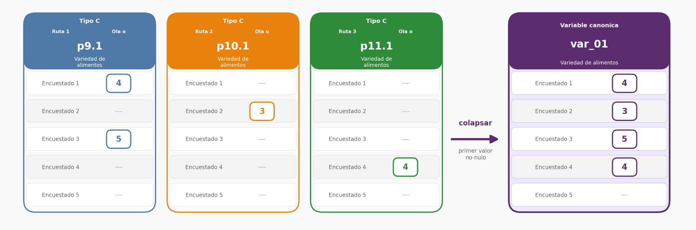
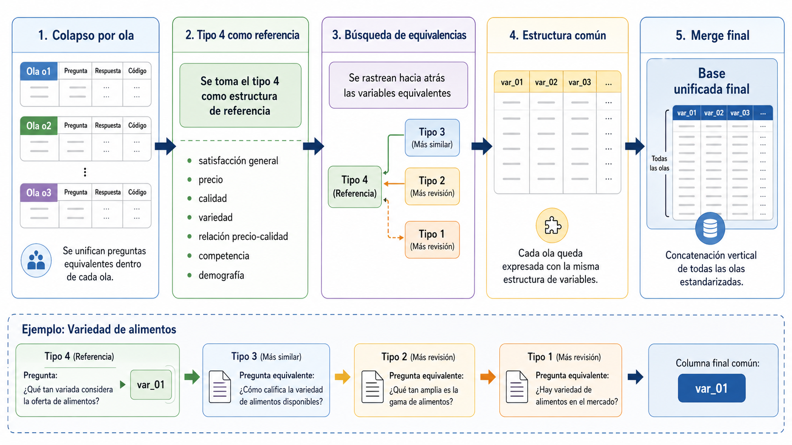
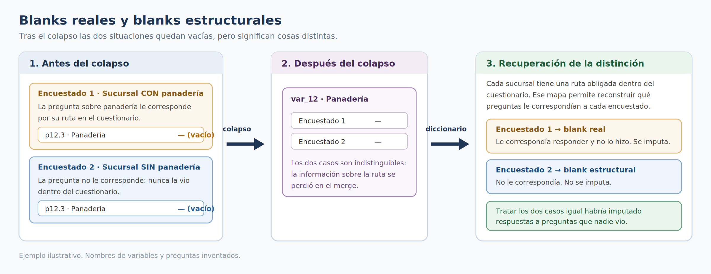
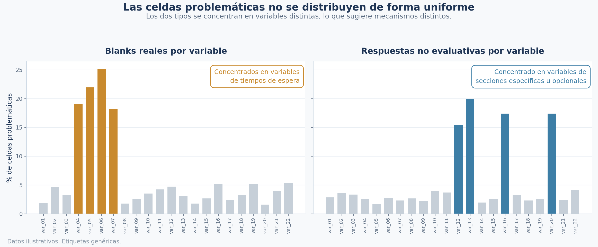
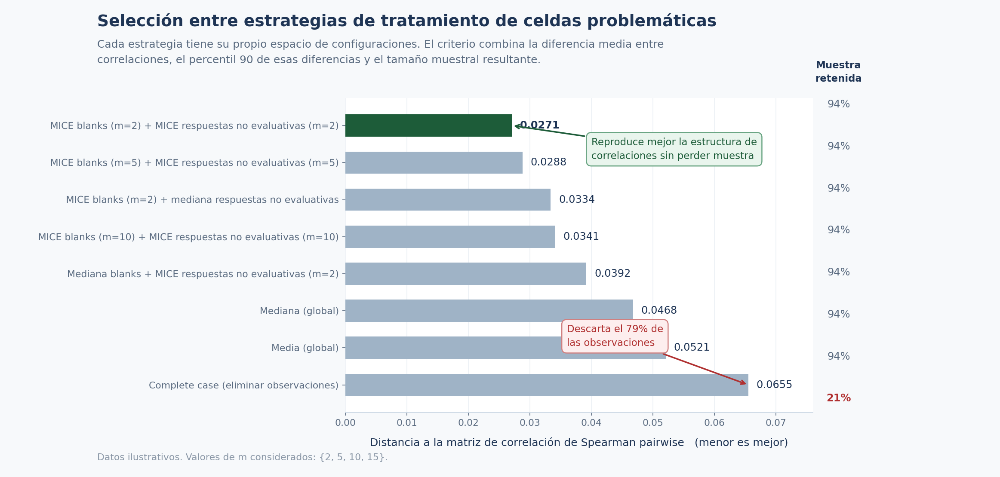

# Análisis de encuestas de satisfacción: decisiones metodológicas

**Español** | [English](README.en.md)

Este repositorio presenta un breve resumen de las principales decisiones metodológicas de mi tesis de Licenciatura en Ciencias de Datos de la Universidad de Buenos Aires, Facultad de Ciencias Exactas y Naturales. El trabajo consistió en integrar encuestas de una cadena de supermercados y analizar qué aspectos de la experiencia de compra se asociaban con la satisfacción global.

Por motivos de confidencialidad, no puedo publicar el nombre de la empresa, los datos originales ni los resultados numéricos. Todos los ejemplos y diagramas utilizan información inventada con fines ilustrativos. Los códigos y valores de esos ejemplos sirven únicamente para explicar los procedimientos.

## Índice

1. [Construcción de una base común](#1-construcción-de-una-base-común)
2. [Blanks reales, blanks estructurales y respuestas no evaluativas](#2-blanks-reales-blanks-estructurales-y-respuestas-no-evaluativas)
3. [Distribución de las celdas problemáticas y mecanismo de faltantes](#3-distribución-de-las-celdas-problemáticas-y-mecanismo-de-faltantes)
4. [Selección de la estrategia de imputación](#4-selección-de-la-estrategia-de-imputación)
5. [Decisiones de modelado](#5-decisiones-de-modelado)
6. [Referencias](#6-referencias)

## 1. Construcción de una base común

Las encuestas estaban distribuidas en archivos correspondientes a distintas olas de relevamiento, es decir, distintas etapas de recolección de respuestas. Además, el cuestionario había cambiado entre esas etapas.

Para construir una base común, primero unifiqué las preguntas equivalentes dentro de cada ola. Después establecí las correspondencias entre las distintas versiones del cuestionario.

### Unificación de preguntas dentro de cada ola

Las preguntas que recibía cada persona dependían de las características y los servicios de la sucursal. Estos recorridos dentro del cuestionario, llamados *rutas*, hacían que un mismo aspecto pudiera aparecer en columnas diferentes.

Por ejemplo, una pregunta sobre variedad de alimentos podía estar registrada como `p9.1`, `p10.1` o `p11.1`, según la ruta. Para analizar ese aspecto en conjunto, reuní las respuestas de las columnas equivalentes en una única variable canónica.

Como las rutas eran excluyentes, para cada encuesta podía corresponder como máximo una de esas preguntas. El colapso se realizaba por fila: se tomaba el primer valor no vacío entre las columnas equivalentes y se conservaba la respuesta original. Esto incluía las respuestas no evaluativas, cuyo tratamiento se abordó después. Si todas las columnas equivalentes estaban vacías, la variable resultante también quedaba vacía.

*Figura 1. Ejemplo ilustrativo de la construcción de una variable canónica a partir de preguntas ubicadas en distintas rutas. Los códigos, las preguntas y las respuestas son inventados.*

### Correspondencias entre versiones

El colapso resolvía las diferencias entre rutas, pero las bases de distintas olas todavía podían tener estructuras diferentes. Entre versiones habían cambiado la redacción, la ubicación y la organización de las preguntas.

Tomé la versión más reciente como referencia porque incorporaba las revisiones realizadas al cuestionario. Su estructura era más reducida que la de las primeras versiones. A partir de sus preguntas relevantes para el análisis, identifiqué los aspectos equivalentes en los cuestionarios anteriores.

La correspondencia requería revisar el contenido de las preguntas. En el ejemplo ilustrativo, “¿Qué tan variada considera la oferta de alimentos?” y “¿Cómo califica la variedad de alimentos disponibles?” se asignan a una misma variable porque ambas evalúan la variedad de la oferta.

Cuando un aspecto no tenía una pregunta equivalente en una versión, su columna quedaba vacía en las olas correspondientes. Todas las olas compartían así la misma estructura, aunque algunas variables tuvieran disponibilidad parcial.

Con ese mapeo, expresé las variables equivalentes bajo nombres comunes y concatené las olas estandarizadas, conservando una fila por encuesta.

*Figura 2. Esquema ilustrativo del proceso de integración: colapso dentro de cada ola, búsqueda de equivalencias entre versiones y concatenación de las bases estandarizadas.*

La integración requería conservar información sobre el origen de las celdas vacías. En particular, el colapso hacía perder la distinción entre una pregunta sin responder y una pregunta que no correspondía a la ruta de la persona.

## 2. Blanks reales, blanks estructurales y respuestas no evaluativas

En las preguntas disponibles dentro de cada versión del cuestionario, distinguí dos tipos de celdas vacías:

- **Blank real:** la pregunta correspondía a la ruta de la persona, pero había quedado sin responder.
- **Blank estructural:** la pregunta no formaba parte de esa ruta.

La distinción importaba porque solo el primer caso representaba una falta de respuesta a una pregunta aplicable. Contabilizar ambos de la misma manera mezclaba la falta de respuesta con la estructura del cuestionario.

### Recuperación de la información de las rutas

Después del colapso, ambos casos podían quedar representados por una celda vacía en la variable canónica. Para recuperar su origen, utilicé un diccionario que identificaba la ruta correspondiente a cada sucursal dentro de cada versión del cuestionario.

Al cruzar esa información con la base unificada, pude distinguir los blanks reales de los estructurales y conservar esa clasificación para las etapas posteriores. También debía tenerse en cuenta la disponibilidad de las preguntas entre versiones: la ausencia de una pregunta en un cuestionario no representaba una omisión del encuestado.

*Figura 3. Ejemplo ilustrativo de dos celdas vacías con distinto origen. La información de la ruta permite distinguir una pregunta sin responder de una pregunta que no correspondía. Las preguntas y respuestas son inventadas.*

### Respuestas fuera de la escala ordinal

Las preguntas evaluativas utilizaban una escala ordinal de satisfacción. Algunas respuestas registradas no expresaban una evaluación dentro de esa escala y, por lo tanto, no podían ordenarse junto con las categorías evaluativas.

Tratar estas respuestas como niveles adicionales de satisfacción habría introducido un orden que su significado no justificaba. Por eso las identifiqué por separado de las respuestas ordinales y de los blanks, para evaluar su tratamiento al comparar las estrategias de imputación.

Los blanks estructurales conservaron un tratamiento separado, ligado a la no aplicabilidad de la pregunta. Su codificación para el modelo se describe en la sección de decisiones de modelado.

## 3. Distribución de las celdas problemáticas y mecanismo de faltantes

Antes de elegir una estrategia de imputación, analicé por separado los blanks reales y las respuestas no evaluativas. El objetivo era evaluar la pérdida de observaciones que implicaría trabajar únicamente con casos completos y examinar cómo se distribuían estas celdas.

### Caracterización de los patrones

El análisis contempló tres niveles:

- **Por encuesta y versión del cuestionario:** cantidad de blanks reales y respuestas no evaluativas presentes en cada observación, agrupada según el tipo de cuestionario.
- **Por variable:** frecuencia de cada tipo de celda problemática en las preguntas evaluativas.
- **Por sucursal:** distribución de blanks reales y respuestas no evaluativas entre distintos contextos de aplicación del cuestionario.

Los porcentajes por variable tenían denominadores distintos. Para los blanks reales, consideré las encuestas en las que la pregunta era aplicable. Para las respuestas no evaluativas, consideré a quienes habían respondido esa pregunta. En la comparación por sucursal, ambos porcentajes se calcularon sobre las celdas aplicables.

*Figura 4. Ejemplo ilustrativo de la distribución de blanks reales y respuestas no evaluativas. Las variables y los porcentajes son inventados.*

Esta caracterización permitió considerar tanto la cantidad de información que se perdería al eliminar observaciones como la posibilidad de que blanks reales y respuestas no evaluativas respondieran a mecanismos diferentes.

### Supuesto adoptado para la imputación

Los patrones examinados motivaron trabajar sin asumir MCAR, es decir, sin suponer que la ausencia de una evaluación era independiente de la información observada y no observada. Esta decisión se apoyó en el análisis descriptivo de las distribuciones.

Para aplicar MICE, adopté MAR como hipótesis de trabajo: la probabilidad de ausencia podía depender de la información observada, pero se suponía independiente de los valores no observados una vez condicionada a esa información ([van Buuren, 2018](#ref-van-buuren-2018)).

Los datos disponibles no permitían verificar este supuesto ni descartar un mecanismo MNAR, en el que la ausencia seguiría dependiendo de información no observada después de considerar la información disponible. Por eso, también comparé MICE con otras estrategias de tratamiento de las celdas problemáticas. Esa comparación permitió evaluar la sensibilidad de la estructura de correlaciones a las distintas decisiones de imputación, manteniendo explícita la incertidumbre sobre el mecanismo de faltantes.

## 4. Selección de la estrategia de imputación

La elección del tratamiento de las celdas problemáticas debía considerar dos aspectos: cuánto modificaba las asociaciones entre variables y cuántas observaciones permitía conservar. Para compararlos, definí un criterio basado en las matrices de correlación de Spearman y el tamaño muestral resultante.

### Alternativas evaluadas

Comparé estrategias basadas en MICE ([Raghunathan et al., 2001](#ref-raghunathan-2001)), imputación por media o mediana de la variable o del bloque, y combinaciones que asignaban tratamientos distintos a los blanks reales y a las respuestas no evaluativas. También incluí el análisis de casos completos y alternativas con filtros según la cantidad de celdas problemáticas por observación.

Esta comparación permitía evaluar distintas formas de completar o filtrar la base, manteniendo separados los dos tipos de celdas problemáticas.

### Criterio de comparación

Tomé como referencia la matriz de correlación de Spearman *pairwise*, calculada utilizando, para cada par de variables, las observaciones con respuestas válidas en ambas. Para construirla, los blanks y las respuestas no evaluativas se representaron como valores faltantes.

Elegí Spearman porque las variables evaluativas provenían de escalas ordinales. La comparación se centró así en las asociaciones entre sus rangos.

Sea $R^P$ la matriz de referencia y $R^E$ la matriz obtenida con una alternativa de tratamiento $E$. Para cada par de variables, definí la diferencia absoluta:

$$\Delta_{jk}^{P,E} = \left|R_{jk}^{P}-R_{jk}^{E}\right|.$$

Consideré el conjunto de pares

$$S=\lbrace (j,k):1\leq j\lt k\leq p\rbrace ,$$

donde $p$ es la cantidad de variables. La condición $j\lt k$ excluye la diagonal y evita contar dos veces el mismo par.

A partir de esas diferencias, calculé su media:

$$\overline{\Delta}^{P,E} = \frac{1}{|S|} \sum_{(j,k)\in S}\Delta_{jk}^{P,E}.$$

También calculé el percentil 90 de las diferencias absolutas. La media resume el cambio general entre las matrices, mientras que el percentil 90 incorpora las diferencias situadas en la parte alta de la distribución.

El criterio combinado quedó definido como:

$$C^{P,E} = \frac{ \lambda\thinspace \overline{\Delta}^{P,E} + (1-\lambda)\thinspace  Q_{0.90}\negthinspace \left( \lbrace \Delta_{jk}^{P,E}:(j,k)\in S\rbrace  \right) }{ N_E }, \qquad 0\leq\lambda\leq1,$$

donde $N_E$ es la cantidad de observaciones conservadas por la alternativa $E$, y $Q_{0.90}$ es el percentil 90. Utilicé $\lambda=0.5$, dando el mismo peso a ambos componentes.

Un valor menor de este score indica una alternativa preferible según el criterio. Entre dos alternativas $E$ y $E'$, este criterio favorece a $E$ si:

$$C^{P,E}\lt C^{P,E'}.$$

La división por $N_E$ incorpora una preferencia por retener observaciones. A igual discrepancia entre matrices, una alternativa que conserva la mitad de las observaciones obtiene el doble de score. Esta ponderación es una decisión de diseño del criterio para combinar proximidad a la referencia y retención de muestra.

*Figura 5. Comparación ilustrativa de ocho alternativas mediante el criterio definido. Tres corresponden a configuraciones de la grilla de MICE y permiten ilustrar la elección por costo computacional ante diferencias pequeñas de score. Los scores y porcentajes de muestra retenida son inventados.*

La matriz pairwise funciona como referencia empírica de la comparación. La proximidad a ella no garantiza recuperar las asociaciones que tendría una base completamente observada.

### Búsqueda de configuraciones y parsimonia

Cada estrategia tenía sus propias decisiones de configuración. Algunas dependían de la cantidad de imputaciones; otras, de la tolerancia de celdas problemáticas permitida por observación.

Para la alternativa que utilizaba MICE en ambos tipos de celdas, el procedimiento se organizó en dos etapas: primero se imputaban los blanks reales aplicables y después las respuestas no evaluativas. Definí $m_{\mathrm{blanks}}$ como la cantidad de bases generadas en la primera etapa, y $m_{\mathrm{NE}}$ como la cantidad generada en la segunda por cada base de la primera. Exploré:

$$m_{\mathrm{blanks}},\thinspace m_{\mathrm{NE}}\in\lbrace 2,5,10,15\rbrace .$$

En este procedimiento, la cantidad total de bases generadas era:

$$m_{\mathrm{total}} = m_{\mathrm{blanks}}\thinspace m_{\mathrm{NE}}.$$

Las alternativas se compararon mediante el criterio definido, considerando además su costo computacional. Dentro de MICE, la configuración $(m_{\mathrm{blanks}},m_{\mathrm{NE}})=(2,2)$ tuvo el peor score entre los pares evaluados. Como las diferencias entre pares eran pequeñas según ese criterio, elegí esa configuración por su menor costo computacional: generaba cuatro bases imputadas en el procedimiento de dos etapas.

También consideré el carácter estocástico del procedimiento, por el cual pequeñas diferencias entre configuraciones podían depender de las semillas utilizadas.

## 5. Decisiones de modelado

Ajusté modelos lineales para estudiar qué aspectos de la experiencia de compra se asociaban con la satisfacción global.

### Representación de los blanks estructurales

Para construir la matriz del modelo, centré las variables evaluativas usando sus valores definidos entre las observaciones aplicables. Después asigné cero a los blanks estructurales. Con esta representación, una variable que no correspondía a una encuesta tenía una contribución nula en el predictor lineal.

### Ponderación e incertidumbre

La distribución de la satisfacción global estaba desbalanceada. Para reducir el predominio de las respuestas más frecuentes en el ajuste, utilicé mínimos cuadrados ponderados (WLS), con pesos inversamente proporcionales a la frecuencia de los grupos de respuesta. Agrupé algunas categorías poco frecuentes únicamente para calcular los pesos y moderar las ponderaciones extremas.

Los diagnósticos sobre los residuos del modelo OLS aportaron evidencia de heterocedasticidad. Por eso utilicé errores estándar robustos HC3 para calcular la incertidumbre de los coeficientes ([MacKinnon y White, 1985](#ref-mackinnon-white-1985)).

### Selección de variables y validación temporal

Busqué reducir la cantidad de variables conservando la posibilidad de interpretar cada aspecto evaluado. Utilicé selección secuencial de variables (SFS), que incorporaba variables según su aporte a la reducción del error cuadrático medio ponderado en validación temporal.

La incorporación continuaba mientras la mejora superara una tolerancia `tol`. Ajusté esta tolerancia mediante una búsqueda en grilla, evaluando el desempeño de los modelos resultantes.

La validación respetó el orden de las olas mediante ventanas de entrenamiento expansivas: cada modelo se entrenaba con observaciones anteriores y se evaluaba sobre un bloque posterior ([Roberts et al., 2017](#ref-roberts-2017)). Dentro de cada partición, la imputación y las medias de centrado se estimaban usando únicamente el conjunto de entrenamiento. También reservé un conjunto final de olas posteriores para evaluar el desempeño fuera de muestra.

En la validación trabajé con una base obtenida al promediar las imputaciones de cada partición. Para la inferencia final, ajusté el modelo en cada base imputada y combiné las estimaciones y su incertidumbre mediante las reglas de [Rubin (1987)](#ref-rubin-1987).

### Asimetrías y formatos de tienda

También estimé un modelo que distinguía las asociaciones de las evaluaciones favorables y desfavorables con la satisfacción global. El objetivo era examinar posibles asimetrías compatibles con *loss aversion* ([Tversky y Kahneman, 1991](#ref-tversky-kahneman-1991)), manteniendo una interpretación asociativa.

Además, ajusté modelos por formato de tienda para explorar diferencias entre contextos de compra ([Goić et al., 2021](#ref-goic-2021)). La clasificación de formatos se apoyó en el tamaño y las características de las sucursales.

## 6. Referencias

Esta selección reúne referencias de la tesis y lecturas complementarias sobre los métodos descritos.

### Faltantes e imputación múltiple

- Raghunathan, T. E., Lepkowski, J. M., Van Hoewyk, J. y Solenberger, P. (2001). [A multivariate technique for multiply imputing missing values using a sequence of regression models](https://www150.statcan.gc.ca/n1/en/catalogue/12-001-X20010015857). *Survey Methodology, 27*(1), 85–95.
- Rubin, D. B. (1987). [Multiple Imputation for Nonresponse in Surveys](https://doi.org/10.1002/9780470316696). Wiley. Lectura complementaria sobre imputación múltiple y combinación de estimaciones.
- van Buuren, S. (2018). [Flexible Imputation of Missing Data](https://doi.org/10.1201/9780429492259) (2.ª ed.). Chapman & Hall/CRC. Lectura complementaria sobre mecanismos de faltantes y estrategias de imputación.

### Errores estándar robustos y validación

- MacKinnon, J. G. y White, H. (1985). [Some heteroskedasticity-consistent covariance matrix estimators with improved finite sample properties](https://doi.org/10.1016/0304-4076%2885%2990158-7). *Journal of Econometrics, 29*(3), 305–325.
- Roberts, D. R. et al. (2017). [Cross-validation strategies for data with temporal, spatial, hierarchical, or phylogenetic structure](https://doi.org/10.1111/ecog.02881). *Ecography, 40*(8), 913–929.

### Asimetrías y formatos de tienda

- Tversky, A. y Kahneman, D. (1991). [Loss aversion in riskless choice: A reference-dependent model](https://doi.org/10.2307/2937956). *The Quarterly Journal of Economics, 106*(4), 1039–1061.
- Goić, M., Levenier, C. y Montoya, R. (2021). [Drivers of customer satisfaction in the grocery retail industry: A longitudinal analysis across store formats](https://doi.org/10.1016/j.jretconser.2021.102505). *Journal of Retailing and Consumer Services, 60*, 102505.
